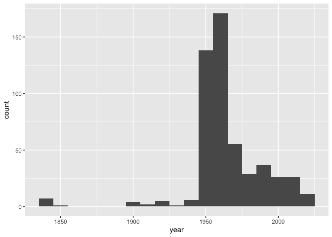

Lab 08 - University of Edinburgh Art Collection
================
Rowan Kemmerly
5/3/2023

### Load packages and data

``` r
library(tidyverse) 
library(skimr)
```

``` r
# Remove eval = FALSE or set it to TRUE once data is ready to be loaded
uoe_art <- read_csv("data/uoe-art.csv")
```

### Exercise 1

The actual link has “<https://collections.ed.ac.uk/art>” before
the”/record” part, so I’ve fixed the URLs via str_replace to reflect
that.

``` r
# links <- page %>%
#   html_nodes(".iteminfo") %>%
#   html_node("h3 a") %>%
#   html_attr("href") %>%
#   str_replace("\\.", "https://collections.ed.ac.uk/art")
```

### Exercise 2

``` r
# artists <- page %>%
#   html_nodes(".iteminfo") %>%
#   html_node(".artist") %>%
#   html_text() 
```

### Exercise 3

``` r
# first_ten <- tibble(
#   title = titles,
#   artist = artists,
#   link = links
# )
```

### Exercise 4

``` r
# set url ----------------------------------------------------------------------
# 
# second_url <- "https://collections.ed.ac.uk/art/search/*:*/Collection:%22edinburgh+college+of+art%7C%7C%7CEdinburgh+College+of+Art%22?offset=10"
# 
# # read second page --------------------------------------------------------------
# 
# page <- read_html(second_url)
# 
# # scrape titles ----------------------------------------------------------------
# 
# titles <- page %>%
#   html_nodes(".iteminfo") %>%
#   html_node("h3 a") %>%
#   html_text() %>%
#   str_squish()
# 
# # scrape links -----------------------------------------------------------------
# 
# links <- page %>%
#   html_nodes(".iteminfo") %>%
#   html_node("h3 a") %>%
#   html_attr("href") %>%
#   str_replace("\\.", "https://collections.ed.ac.uk/art")
# 
# # scrape artists ---------------------------------------------------------------
# 
# artists <- page %>%
#   html_nodes(".iteminfo") %>%
#   html_node(".artist") %>%
#   html_text()
# 
# # put together in a data frame -------------------------------------------------
# 
# second_ten <- tibble(
#   title = titles,
#   artist = artists,
#   link = links
# )
# ```


### Exercise 5

# ```{r scrape-page-function}
# scrape_page <- function(url){
#
#   # read page
#   page <- read_html(url)
#
#   # scrape titles
#   titles <- page %>%
#     html_nodes(".iteminfo") %>%
#     html_node("h3 a") %>%
#     html_text() %>%
#     str_squish()
#
#   # scrape links
#   links <- page %>%
#     html_nodes(".iteminfo") %>%
#     html_node("h3 a") %>%
#     html_attr("href") %>%
#     str_replace("\\.", "https://collections.ed.ac.uk/art")
#
#   # scrape artists
#   artists <- page %>%
#     html_nodes(".iteminfo") %>%
#     html_node(".artist") %>%
#     html_text()
#
#   # create and return tibble
#   tibble(
#     title = titles,
#     artist = artists,
#     link = links
#   )
#
# }
# ```


# ### Exercise 6
# 
# ```{r trying-out-function}
# 
# scrape_page(first_url)
# scrape_page(second_url)
# 
# ```

# Yes, the output looks good to me!


### Exercise 7

# ```{r iteration}
# root <- "https://collections.ed.ac.uk/art/search/*:*/Collection:%22edinburgh+college+of+art%7C%7C%7CEdinburgh+College+of+Art%22?offset="
# numbers <- seq(from = 0, to = 2900, by = 10)
# urls <- glue("{root}{numbers}")
```

<!-- ### Exercise 8 -->
<!-- ```{r creating-new-df} -->
<!-- # uoe_art <- map_dfr(urls, scrape_page) -->
<!-- ``` -->
<!-- ### Exercise 9 -->
<!-- # ```{r new-df} -->
<!-- # write_csv(uoe_art, file = "data/uoe-art.csv") -->
<!-- #  -->
<!-- # uoe_art <- read_csv("data/uoe-art.csv") -->
<!-- #  -->
<!-- # uoe_art -->
<!-- # ``` -->
<!-- For whatever reason there are only 982 pieces of art showing up and not 3017! (I took a screenshot of this on the UOE website that's in this repo.) -->

### Exercise 10

``` r
uoe_art <- uoe_art %>%
  separate(title, into = c("title", "date"), sep = "\\(") %>%
  mutate(year = str_remove(date, "\\)") %>% as.numeric()) %>%
  select(title, artist, year, link)
```

    ## Warning: Expected 2 pieces. Additional pieces discarded in 11 rows [44, 143,
    ## 155, 173, 242, 385, 526, 827, 938, 942, 951].

    ## Warning: Expected 2 pieces. Missing pieces filled with `NA` in 215 rows [5, 8,
    ## 16, 17, 24, 45, 47, 52, 53, 57, 61, 64, 65, 67, 69, 73, 81, 89, 92, 93, ...].

    ## Warning in str_remove(date, "\\)") %>% as.numeric(): NAs introduced by coercion

So it looks like it’s throwing out information beyond title, artist,
year, and link, but I guess that’s okay since we just want the titles
and years. And it’s talking about how for some pieces there is no date
so date is “NA”—we knew this already.

### Exercise 11

``` r
skim(uoe_art)
```

|                                                  |         |
|:-------------------------------------------------|:--------|
| Name                                             | uoe_art |
| Number of rows                                   | 982     |
| Number of columns                                | 4       |
| \_\_\_\_\_\_\_\_\_\_\_\_\_\_\_\_\_\_\_\_\_\_\_   |         |
| Column type frequency:                           |         |
| character                                        | 3       |
| numeric                                          | 1       |
| \_\_\_\_\_\_\_\_\_\_\_\_\_\_\_\_\_\_\_\_\_\_\_\_ |         |
| Group variables                                  | None    |

Data summary

**Variable type: character**

| skim_variable | n_missing | complete_rate | min | max | empty | n_unique | whitespace |
|:--------------|----------:|--------------:|----:|----:|------:|---------:|-----------:|
| title         |         1 |          1.00 |   0 |  79 |     3 |      507 |          0 |
| artist        |        40 |          0.96 |   2 |  55 |     0 |      549 |          0 |
| link          |         0 |          1.00 |  59 |  60 |     0 |      982 |          0 |

**Variable type: numeric**

| skim_variable | n_missing | complete_rate |    mean |    sd |   p0 |  p25 |  p50 |  p75 | p100 | hist  |
|:--------------|----------:|--------------:|--------:|------:|-----:|-----:|-----:|-----:|-----:|:------|
| year          |       463 |          0.53 | 1964.48 | 25.76 | 1835 | 1953 | 1961 | 1975 | 2020 | ▁▁▁▇▂ |

40 are missing an artist name, 463 are missing a year.

### Exercise 12

``` r
uoe_art_histogram <- ggplot (uoe_art, aes(x = year)) +
  geom_histogram(binwidth = 10)

  
uoe_art_histogram
```

    ## Warning: Removed 463 rows containing non-finite values (`stat_bin()`).

<!-- --> Nothing especially
out of the ordinary—though this could be because my dataset is smaller
than what the lab was originally oriented for.

### Exercise 13

(not relevant for the data set I’m working with)

### Exercise 14

``` r
most_common_artist <- uoe_art %>%
  group_by(artist) %>%
  summarise(count = n()) %>%
  arrange(desc(count))

most_common_artist
```

    ## # A tibble: 550 × 2
    ##    artist               count
    ##    <chr>                <int>
    ##  1 Unknown                119
    ##  2 Emma Gillies            55
    ##  3 <NA>                    40
    ##  4 Joanne Leonie Milne      7
    ##  5 John Bellany             7
    ##  6 John Houston             6
    ##  7 William Gillon           6
    ##  8 Zygmunt Bukowski         6
    ##  9 Alan M. Alexander        5
    ## 10 Alexander F Mitchell     5
    ## # … with 540 more rows

Other than works for which the artist is unknown, Emma Gillies is the
most common artist in the collection! I hadn’t heard of her before, but
it looks like her alma mater was UOE (she was a potter) so it makes
sense that they have a lot of her pieces in thier collection.

### Exercise 15

``` r
library(tidyverse)

uoe_art %>% 
  filter(str_detect(title, "child|Child")) %>% 
  summarise(n = n())
```

    ## # A tibble: 1 × 1
    ##       n
    ##   <int>
    ## 1     4

There are four works of art with “child” or “Child: in the title!
